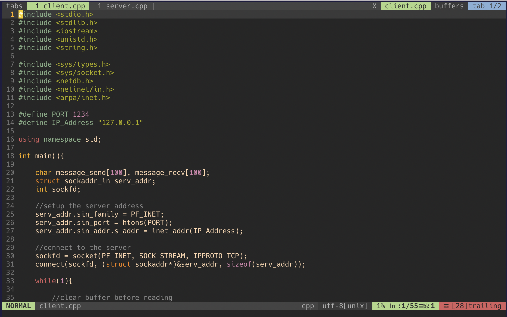
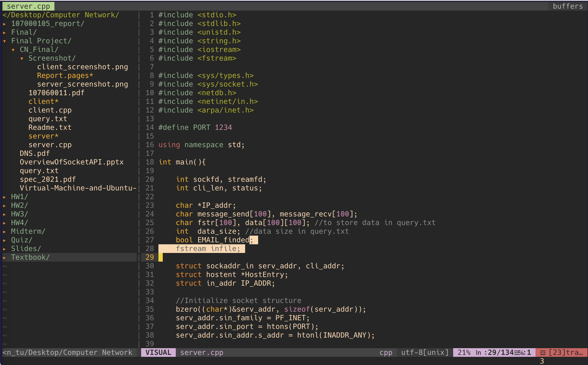
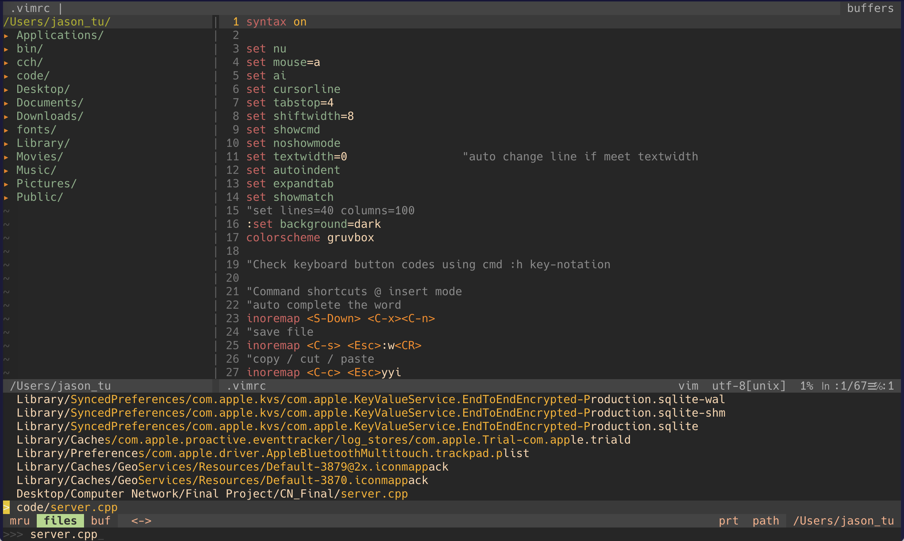
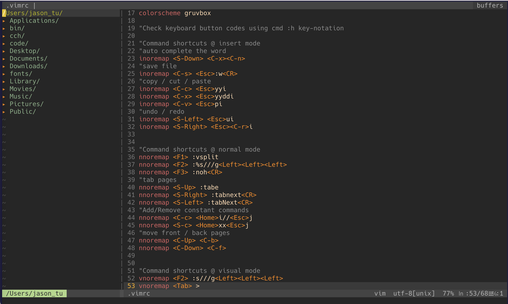

# Vim 編寫程式環境 ＆ HDL快捷鍵設置

接下來的內容會先介紹：

1. Vim好用的外掛插件 
2. 我的Vim設定檔 
3. HDL (Hardware Description Langueage) 快捷鍵設定

如果有時間的話，自己動手研究Vim script可以學到蠻多東西的，coding也會更容易上手！


## 外掛插件

### Vim-plug  

Vim-plug 為Vim**管理外掛插件**中好用的套件。

* Vim檔案管理規劃

  設定檔 `.vimrc` 、 `.gvimrc` 可以透過此規劃，自動地讀取相對應的vim script，不用額外在設定檔 source script (當然這個做法也是可以) 。關於Vim檔案管理規劃，根據各種不同的vim script，在 `~/.vim` 文件下會有對應的目錄。例如：與背景主題配色相關的script會放在 `~/.vim/colors` 、跟**外掛插件有關的放在 `~/.vim/plugin`** 等等。如果想知道更多目錄配置，可以在Vim Normal mode輸入 `:h vimfiles` 查詢。

* Installation (Unix) & Configurations

  將下列下載指令複製到terminal執行：

  ```visual basic
  $ curl -fLo ~/.vim/autoload/plug.vim --create-dirs \
      https://raw.githubusercontent.com/junegunn/vim-plug/master/plug.vim
  ```

  安裝完後，在 `.vimrc` 加入以下指令：

  ```visual basic
  call plug#begin('~/.vim/plugged')
  "---------------------------------------------------------
  " Put website links of Plug-ins you want in this part
  " E.g., Plug 'vim-airline/vim-airline'
  "---------------------------------------------------------
  call plug#end()
  ```

  在plug#begin, #end中間部分，請放插件的**github相對連結 (e.g., URL = https://github.com/vim-airline/vim-airline ，請放Plug 'vim-airline/vim-airline')** 。

  重新載入 `.vimrc` ，輸入 `:PlugInstall` 就會自動將插件各個檔案分不同目錄載入 `~/.vim/plugged` 。

* Pros
  * 下載速度較快、簡便、容易使用
  * 具插件管理功能 (若不需要僅需砍掉特定目錄即可)

* URL
  * https://github.com/junegunn/vim-plug (官方版有比較完整的功能介紹)
---

### Vim-airline

Vim-airline 可使Vim下方增加狀態列(顯示Insert、Normal、Visual mode、目前行數以及此為什麼類型的檔案)、上方增加分頁欄列。看起來如下：



* Installation (Using Vim-plug) & Configurations

  將下方貼入 `.vimrc` 並重新載入執行 `:PlugInstall` :

  ```visual basic
  Plug 'vim-airline/vim-airline'
  Plug 'vim-airline/vim-airline-themes'
  ```

  Note : vim-airline-themes提供許多主題，可以去其目錄套用vim scripts。

  套用主題指令：

  ```visual basic
  :AirlineTheme <theme>          "Set in Vim Normal Mode
  let g:airline_theme='<theme>'  "Set in .vimrc
  ```

  開啟分頁欄列指令：

  ```visual basic
  let g:airline#extensions#tabline#enabled = 1
  ```

  若想更加美化主題，可下載字體 [powerline-fonts][1]，並加入：

  ``` visual basic
  let g:airline_powerline_fonts = 1
  ```

* URL
  * https://github.com/vim-airline/vim-airline
  * https://github.com/vim-airline/vim-airline-themes
---

### NERDTree

NERDTree 為Vim樹狀檔案管理的插件，與VS Code、MobaXterm這一類軟體的檔案管理功能相近 (甚至更方便～)。看起來如下：



* Installation (Using Vim-plug) & Configurations

  將下方貼入 `.vimrc` 並重新載入執行 `:PlugInstall` :

  ``` visual basic
  Plug 'preservim/nerdtree'
  ```

  啟動(關閉)NERDTree指令：

  ```visual basic
  :NERDTreeToggle
  ```

  每次啟動(關閉)都輸入以上指令很不方便，建議使用key-mapping的方式，在 `.vimrc` 設定：

  ```visual basic
  nnoremap <F10> :NERDTreeToggle<CR>  "push <F10> to activate in Normal mode
  ```

  若要消除NERDTree最上方版面的 `"Press ? for help ` ，請設定：

  ```visual basic
  let NERDTreeMinimalUI = 1
  ```

  若NERDTree介面出現亂碼，請設定：

  ```visual basic
  set encoding = utf-8
  ```

  當關閉最後檔案時，可能會獨自剩NERDTree在版面上，依照官方建議可設定：

  ```visual basic
  " Exit Vim if NERDTree is the only window remaining in the only tab.
  autocmd BufEnter * if tabpagenr('$') == 1 && winnr('$') == 1 && exists('b:NERDTree') && b:NERDTree.isTabTree() | quit | endif
  ```

* Keyboard shortcuts
  * m: 編輯檔案 (按完m後會有manu提供修改、複製、搬移、創建檔案/目錄)
  * o: 展開/回縮目錄
  * C: 進入目錄
  * u: 回上一層目錄
  * t: 檔案開啟分頁
  * I: 選擇是否顯示隱藏檔(如：`.vimrc`)

* URL
  * https://github.com/preservim/nerdtree (官方版)
  * https://gist.github.com/ifels/e0a6d79ee60e113f4294 (NERDTree 快捷鍵參考)
---

### Ctrlp

Ctrlp為Vim搜尋檔案的插件。可藉由輸入檔名，ctrlp會找到所有相關的檔案，關係由小到大排列出來。
看起來如下：



* Installation (Using Vim-plug) & Configurations

  將下方貼入 `.vimrc` 並重新載入執行 `:PlugInstall` :

  ```visual basic
  Plug 'kien/ctrlp.vim'
  ```

  若不想要搜尋特定類型的檔案，可設定：

  ```visual basic
  let g:ctrlp_custom_ignore = {
    \ 'dir':  '\v[\/]\.(git|hg|svn)$',
    \ 'file': '\v\.(exe|so|dll)$',
    \ 'link': 'some_bad_symbolic_links',
    \ }
  ```

* Keyboard shortcuts
  * <C-p> : 啟動搜尋
  * <C-d> : 以檔名為搜尋範圍(範圍較小、較精準)
  * <C-t> : 分頁方式打開文件
  * <C-x>, <C-v> : 水平、垂直分屏打開文件

* URL
  * https://github.com/kien/ctrlp.vim (官方版)
---

### Vim-surround

Vim-surround 可針對單詞快速加上/去除引號，或是輕易地將引號做置換(不限定單詞)。

* Installation (Using Vim-plug)

  將下方貼入 `.vimrc` 並重新載入執行 `:PlugInstall` :

  ```visual basic
  Plug 'tpope/vim-surround'
  ```

* Keyboard shortcuts
  * 將文字選取後按 S<引號> : 增加引號
  * ysw<引號> : 將此處單詞增加引號
  * yss<引號> : 整行加上引號
  * ds<引號> : 刪除引號
  * cs<引號1><引號2> : 將<引號1>置換成<引號2>
  * **.**  :  可重複上一動 (但須額外加裝[vim-repeat][2])

* URL
  * https://github.com/tpope/vim-surround (官方版)


## 我的Vim設定檔

我的Vim背景主題為gruvbox，若想套用其他背景主題可以去 [vimcolorschemes][3] 找喜歡的，到指定的github將vim script載入到 `~/.vim/colors` 內，並在 `.vimrc` 設定 `colorscheme <theme>`。

我的Vim-airline主題為angr，若想更改請到下載插件的地方套用其vim script(上個部分Vim-airline有提及)。

我的Vim看起來如下(其實跟前面差不多)：



* Suggestion
  * 可以使用key-mapping function刻一些快捷鍵(以上為我的範例，可參考)。
  * 若不知道按鍵在Vim裡對應的名稱，可打指令 `:h key-notation` 查詢。

* Installation

  若想使用我的Vim設定，可透過以下方式安裝(請先把自己的 `.vimrc` 、 `.gvimrc` 以及 `.vim` 備份!!)：

  ```visual basic
  $ cd ~
  $ rm -rf .vimrc .vim .gvimrc
  $ git clone https://github.com/Hao-Jiun-Tu/vim-setting.git .vim
  $ ln -s .vim/.vimrc .vimrc
  $ ln -s .vim/.gvimrc .gvimrc
  ```

  最後，開啟Vim在Normal mode，輸入 `:PlugInstall` 指令安裝外掛插件。

  


[1]: https://github.com/powerline/fonts	"Powerline-fonts"
[2]: https://github.com/tpope/vim-repeat "Vim-repeat"
[3]: https://vimcolorschemes.com/ "Vimcolorschemes"

